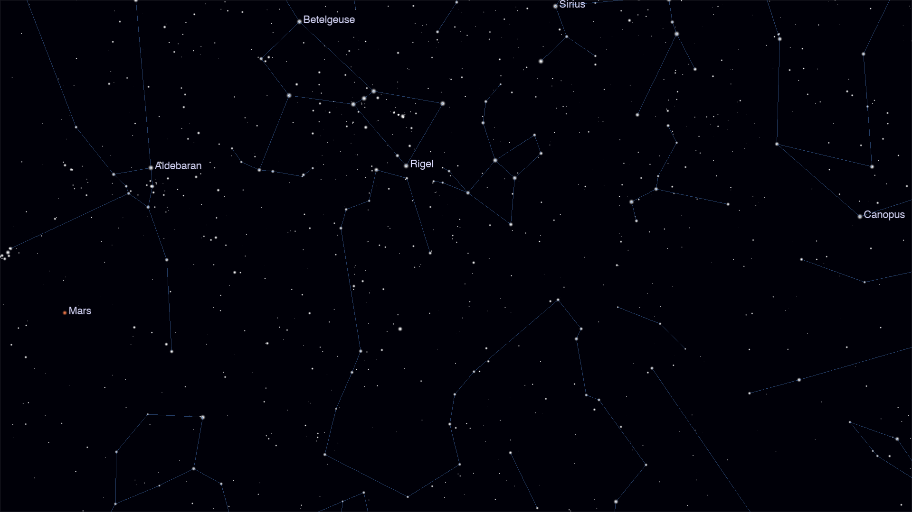

# XREAL One Pro Sky

A native macOS prototype that renders the live night sky to a pair of
[XREAL One Pro](https://www.xreal.com/) AR glasses. Put the glasses on, look
around, and the stars, constellation lines, planets, Sun, and Moon track your
head in real time, gravity-down correct.



## What this is

An explicit **prototype**, built to validate the full pipeline (head tracking →
orientation → sky math → rendering) cheaply before committing to a "real" stack
(e.g. Swift/Metal). The quality bar is "feels right and proves the concept,"
not "shippable product." The full design rationale lives in
[`docs/superpowers/specs/2026-06-21-xreal-sky-design.md`](docs/superpowers/specs/2026-06-21-xreal-sky-design.md).

It runs without the glasses too: with no hardware attached it falls back to a
windowed dev mode you drive with the mouse, so the renderer and the astronomy
math are fully developable on a laptop.

## Features

- **3DoF head tracking** straight off the glasses' IMU, no SDK and no Nebula
  required (see [Hardware notes](#hardware-notes)).
- **Gravity-referenced free-look**: altitude (pitch/roll) is physically correct;
  azimuth is free (no magnetometer, no alignment ritual).
- **Live "now" sky** for a configurable observer latitude/longitude, updating
  continuously as the Earth rotates.
- Full-sky **Hipparcos** stars down to naked-eye magnitude, **Stellarium**
  constellation lines, and **Skyfield** ephemeris for the Sun, Moon, and the
  five naked-eye planets.
- Sparse labels for the brightest stars and the planets.

## How it works

```
 IMU thread (~1000 Hz)            Render loop (~60 fps)
 ┌──────────────────┐            ┌───────────────────────────────┐
 │ TCP socket       │  gyro +    │ snapshot orientation quaternion│
 │ 169.254.2.1      │  accel     │ equatorial → horizontal rotate │
 │ frame 134-B recs │ ─────────▶ │ stars / lines / bodies / labels│
 │ complementary    │            │ moderngl draw → glasses panel  │
 │ filter → quat    │            └───────────────────────────────┘
 └──────────────────┘
```

- `imu/reader.py` owns the socket on a background thread, frames the fixed
  134-byte records, decodes `(gyro, accel)` samples, and auto-reconnects on drop.
- `imu/fusion.py` runs a complementary filter: integrate the gyro for fast
  response, nudge pitch/roll toward the accelerometer's gravity vector to kill
  drift, leave yaw free (matching free-look).
- `sky/` holds the pure coordinate math (RA/Dec → alt/az), the catalog loader,
  and the Skyfield ephemeris wrapper.
- `render/` does the GPU work: point-sprite stars, line-segment constellations,
  billboard planets, and text-texture labels.
- `app.py` wires it together and runs the main loop.

## Requirements

- macOS
- Python 3.12+
- [`uv`](https://docs.astral.sh/uv/)
- A GPU/driver supporting OpenGL 3.3 core
- (Optional) XREAL One Pro glasses for head-tracked mode

## Setup

```sh
uv sync
```

The DE421 planetary ephemeris (`de421.bsp`) ships with the repo. On first run,
Skyfield downloads and caches the Hipparcos star catalog (`hip_main.dat`, ~53 MB)
into the project directory.

## Running

```sh
# Windowed laptop dev mode — drag with the mouse to look around
uv run python app.py

# Fullscreen on the glasses, head-tracked
uv run python app.py --glasses
```

In `--glasses` mode the app auto-detects the 1920×1080 glasses panel among your
displays. Connect the One Pro over USB-C (it appears as a standard external
monitor) and enable developer / Ethernet mode in the glasses OSD so the IMU
socket is reachable.

### Controls

| Input | Action |
|---|---|
| Mouse drag (dev mode) | Look around |
| `R` | Re-center on your current gaze: makes wherever you're looking the level, forward view (also auto-runs once at startup, so look ahead while it levels) |
| `Esc` / window close | Quit |

## Configuration

All user-tunable settings live in [`config.py`](config.py):

| Setting | Default | Meaning |
|---|---|---|
| `LATITUDE_DEG` / `LONGITUDE_DEG` | San Francisco | Observer location (which sky is overhead) |
| `MAG_LIMIT` | 6.5 | Faintest star magnitude to draw |
| `LABEL_MAG_LIMIT` | 1.8 | Only label stars at least this bright |
| `FOV_DEG` | 57.0 | Camera field of view (the One Pro's real FOV) |
| `IMU_HOST` / `IMU_PORT` | `169.254.2.1:52998` | Glasses IMU stream |
| `ACCEL_GAIN` | 0.02 | How hard gravity corrects gyro drift |
| `SHOW_HORIZON` / `SHOW_MILKY_WAY` | on / off | Scene toggles |

## Project layout

```
xreal/
  app.py              # main loop: orientation → camera → draw
  config.py           # all tunable settings
  mathlib.py          # quaternion / vector helpers
  imu/
    reader.py         # TCP socket → 134-byte records → (gyro, accel) samples
    fusion.py         # complementary filter → orientation quaternion
  sky/
    coords.py         # sidereal time, equatorial ↔ horizontal (pure functions)
    catalog.py        # Hipparcos stars + Stellarium constellation lines
    ephemeris.py      # Skyfield: Sun/Moon/planet RA/Dec for now + location
  render/
    scene.py          # moderngl scene: stars, lines, bodies, labels, camera
    labels.py         # text → texture billboards
  probe_imu.py        # standalone IMU stream probe / reference parser
  tests/
```

## Testing

```sh
uv run pytest
```

The suite covers the coordinate math (against Skyfield reference values), the
IMU record parser (replayed against a real captured stream in
`tests/fixtures/imu_capture.bin`), and the fusion filter.

## Hardware notes

Head tracking works over a plain TCP socket: **no SDK, no Nebula, no kernel
driver**. Verified live on a real XREAL One Pro + Mac:

- **Transport:** TCP to `169.254.2.1:52998` over the glasses' USB-ethernet
  link-local interface. The device streams immediately, no handshake. Requires
  developer / Ethernet mode enabled in the glasses OSD.
- **Framing:** fixed **134-byte records**, each starting with header
  `28 36 00 00 00 80`. (The firmware sends no footer, so the community demo's
  header..footer delimiter framing does not apply here.)
- **Payload:** six little-endian `float32` at offset 34 = gyro x,y,z (rad/s)
  then accel x,y,z (m/s²). IMU records carry the marker `00 40 1f 00 00 40` near
  offset 78; other record types are skipped.
- **Rate:** ~1000 Hz, correctly scaled physical units (stationary accel
  magnitude ≈ 9.79 m/s²).

The display side is plug-and-play: the One Pro is a standard 1920×1080 external
monitor over USB-C DisplayPort. Only the IMU needs the socket.

## Out of scope (future work)

Stereo / side-by-side 3D; magnetometer compass and true-north alignment;
time-scrubbing; Moon phase rendering; object search / go-to; deep-sky catalogs.
